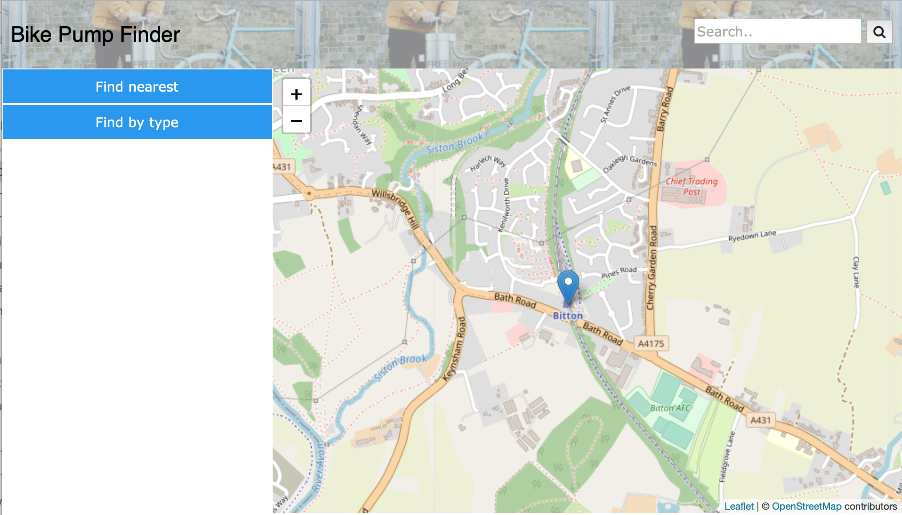

# Deployment

## Release Notes
TODO: Describe the current version of the system (with version number. Include system dependencies ands software tools used.
Are there any known issues? 
Describe the deployment of software components to hardware nodes using a UML Deployment diagram.

# User guide
TODO: Explain how each use-case works by providing step-by-step screenshots for each use-case. This should be based on a tested scenario.

TODO: Repeat as necessary
