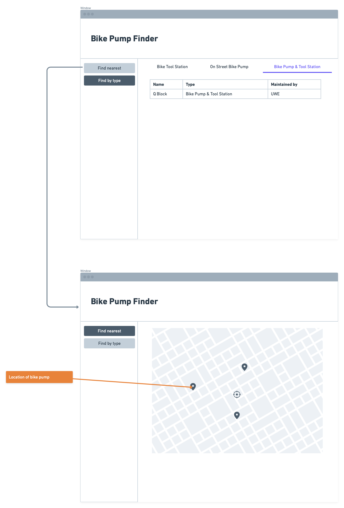

# Design

## Behavioural design
TODO: Describe a concrete scenario for each use-case. 
Describe it in terms of interactions between the components introduces above, and the actors introduced in your requirements.

## User Interface design
TODO: Specify and develop a user interface mockup using a wireframe.

TODO: repeat as necessary
