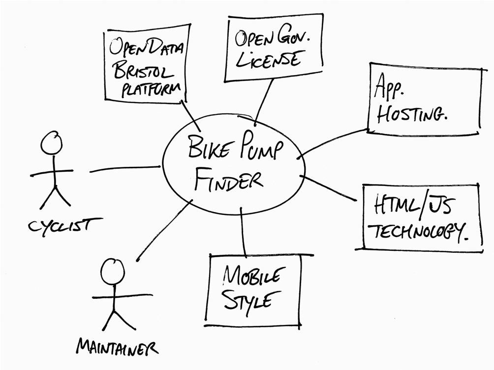

# Project Proposal

## Business Case: Guard - Getting you home safe.

### Problem statement
TODO: Replace the example text like this with text that describes your project. What is the problem to be addressed?

According to 'Plan International' - a charity for children and equality for girls, almost two thirds of adult women (63%) in Britain say they feel unsafe walking alone after dark. Almost half (48%) felt the same way when they were of school age. 

- By utilizing 'BristolOpenData', Guard proposes an all ecompassing application which will signficantly increase the safety of men, women and children getting from destination to destination. With filters for different types of crimes, Guard will provide a map navigation system that will clearly highlight all the areas from previously reported crimes as well as total crimes committed. Full transparency. Guard will also act like a public forumn where users and will be able to report their own crimes by selecting an area on the map (with attachment options and will be moderated by admins/emergency services).

- Guard aims to be used by not only civilians but by emergency services.

- There will be several other functions which will allow users to feel safer walking around incooporated from other applications: Life360, allows you to stay connected to key contacts wherever they are. OneScream, which detects your cry for help and will send an automated text and call to your nominated contacts of your location. Shake2Safety, as people sometimes don't have the time to unlock their phone, this function allows you to very easily send your location/text messages to your emergency contacts by shaking your phone or pressing the button 3 times. An overlay on your lockscreen will also have options to call the police or an emergency contact.

- Upon your phone dying, your last most recent location will also be sent to your chosen emergency contacts.

### Business benefits
TODO: List high-level benefits that this product will provide.
Improve the safety of women and men walking streets and passing through areas;

- Users, emergency services and the government can work together to help incremenate criminals, allowing users a more accessible way to report crimes

- Can very precisely identify where and what crimes happen in each area

- Weekly, monthly and yearly incidents will be displayed using graphs to indicate the number of crimes in areas that may have also decreased (Improved safety).

- Gives people, friends and family an additional sense of safety 

### Options Considered
TODO: What are some other customer options or leading products that address the same needs?

- Life360: "Life360 allows you to stay connected to key contacts wherever they are, when you’re walking home alone at night (or any time!)"

- One Scream: "Once your scream is detected, a text message and an automated call with your location is then sent to your nominated contact."

- Shake2Safety: "The Shafe2Safety app lets you send text messages to emergency contacts, as well as share pictures and audio in emergency situations. By shaking the phone or pressing the power button 4 times, you can send as many text messages as you like to primary contacts, but only one phone call. It’ll work on a locked screen, and also when you have no internet connection, ideal for when you’re walking home alone at night."

### Expected Risks
TODO: What are the main risks of this project?

- For people who are carrying out crimes it can be used in a opposite manner and provide a way to target people

- If not enough people use the data and submitt data it can become outdated and unrleiable ,last years crimes satistics will not be the same as the month/year/day before

- Can be there immediate action done , people may question if the data can be provided to the police and may feel like the app is pointless if people do not see the direct result of someone becoming incremneated 

## Project Scope
TODO: Scope of the System of Interest. Include a bullet list of things from your context diagram that are in scope.

[Spider diagram.docx](https://github.com/j34-chapman/Guard/files/7496774/Spider.diagram.docx)
